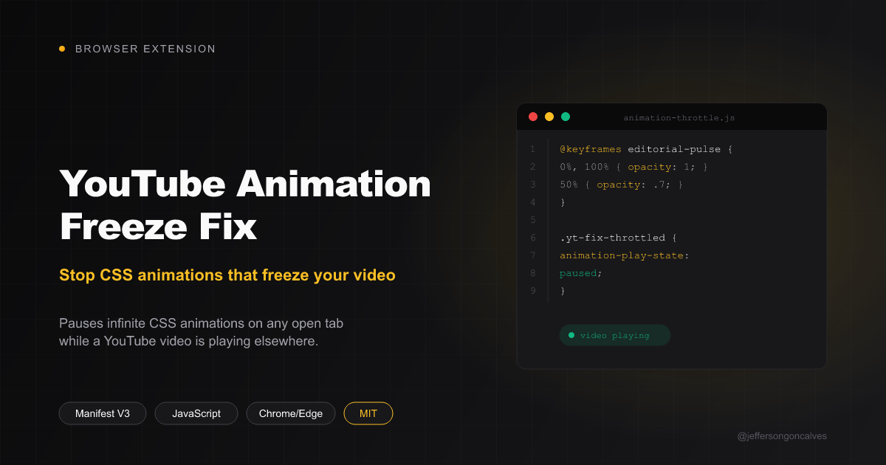

# YouTube Animation Freeze Fix

Chrome/Edge extension (Manifest V3). Fixes YouTube video freeze + buffering
spinner caused by **any site** running an infinite CSS animation (e.g.
`animation: 1.6s cubic-bezier(.65, .0, .35, 1) infinite editorial-pulse`, or
a plain `transform: rotate(...)` spinner) in another tab — reproduces the
same way with dashboards, Laravel Forge progress/status indicators, GitHub's
own spinners, or any similar looping effect.

## Root cause

A sustained CSS animation loop keeps the browser compositing frames on that
page continuously, which competes for GPU/compositor time with video
playback in a **different tab**, causing the freeze + loading spinner.
Earlier versions of this extension only paused animations touching a
paint-triggering property (`box-shadow`, `filter`, `width`, ...) and assumed
`transform`/`opacity`-only animations were compositor-only and harmless -
real testing showed a plain rotating spinner causes the same freeze, so that
distinction was dropped: every infinite animation gets paused now.

## What it does

- `youtube-detector.js` (runs on youtube.com): watches every `<video>` and
  reports play/pause state to the background worker.
- `background.js`: tracks whether any tab has a YouTube video playing, and
  broadcasts that to every open tab.
- `animation-throttle.js` (runs on every page's top document only): tags any
  element with a non-`none` `animation-name` and pauses it
  (`animation-play-state: paused`) while a YouTube video is playing
  anywhere. Resumes them when it stops. New elements are scanned in
  `requestIdleCallback` time slices, and a container that redraws hundreds
  of nodes at once (virtualized widgets like the Monaco editor behind
  Forge's deploy log) is blacklisted from further scans after its first
  oversized batch, since re-scanning a live log on every update was itself
  expensive enough to freeze the page. It also tracks every `<svg>` on the
  page and calls the native `pauseAnimations()`/`unpauseAnimations()` on
  each - SMIL animations (`<animate>`, `<animateTransform>`, common in
  loading-spinner icons) don't set a CSS `animation-name` at all, so
  `check()` alone can't see them; a Forge deploy-toast spinner using
  `<animate attributeName="d" ...>` to morph an SVG path confirmed this
  blind spot.

A `harness/` folder holds a Playwright-based regression check for exactly
that SMIL case (`bun run check-smil.mjs`) plus a cross-tab jank matrix
(`bun run run.mjs`) — see `harness/README.md`.

No data leaves the browser; `<all_urls>` is required only so the throttle
script can run on whatever site has the offending animation. Set `DEBUG =
true` at the top of `animation-throttle.js` for `[yt-fix]`-prefixed console
diagnostics (tagged elements, slow flushes, noisy containers blacklisted).

## Install (unpacked)

1. `chrome://extensions` (or `edge://extensions`)
2. Enable "Developer mode"
3. "Load unpacked" → select this folder
4. Reload the tabs

## License

MIT
